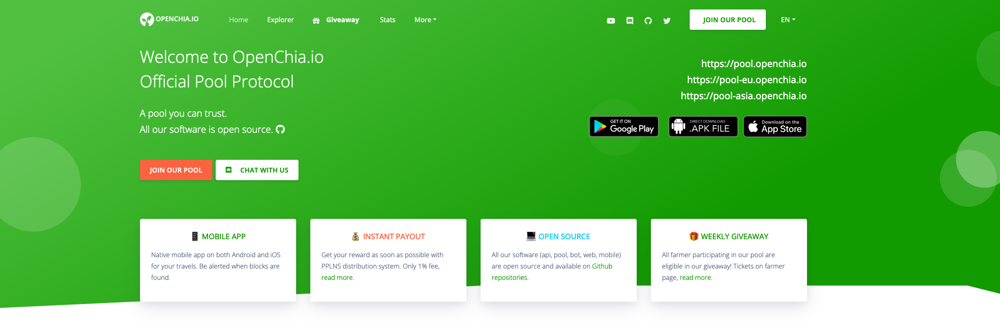

<p align="center">
  <a style="text-decoration:none" href="https://github.com/openchia/web/blob/main/LICENSE.md">
    
  </a>
  <a style="text-decoration:none" href="https://github.com/openchia/web/issues">
    
  </a>
  <a style="text-decoration:none" href="https://github.com/openchia/web/actions/workflows/docker-publish.yml">
    
  </a>
  <a style="text-decoration:none" href="https://discord.gg/2URS9H7RZn">
    
  </a>
  <a style="text-decoration:none" href="https://twitter.com/openchia">
    
  </a>
  <a style="text-decoration:none" href="https://www.youtube.com/channel/UCL70j_KiPd49rfp_UEqxiyQ">
    
  </a>
  <a href="https://translation.openchia.io/engage/openchia/">
    
  </a>
</p>

# OpenChia.io Angular Website

All our software (api, pool, bot, web, mobile, proxy) are open source and available on [Github][1].

## Building UI

### From local

Configure the proxy for the API endpoint in `./src/app/proxy.conf.json` and then run:

```bash
$ npm i
$ npm run start
```

After local build, website will be accessible on [https://localhost:4200](https://localhost:4200).

### From docker

```
$ docker build -t openchia/web .
$ docker container run --rm --name openchia-web -p 8080:80 openchia/web
```

After docker build, website will be accessible on [http://localhost:8080](http://localhost:8080).

By default caddy listen on port 80 but we bind it to port 8080 which allows you to launch image without root permissions.

Variables available in the docker environment:
* `DOMAIN`: website domain (default: `localhost`)
* `LOGLEVEL`: loglevel in stdout (default: `INFO`)
* `LOGFORMAT`: log format in stdout (default: `json`)

## Translation

We are currently using self hosted Weblate.
All you need to do is create an account and translate to your language using the [website here][2].

## Contributing

All contributions are welcome! Please fork main branch and create a new branch, and then create a pull request to the main branch.

Linear merging is enforced on main and merging requires a completed build and review. Please make sure your code/build is passing.
The main branch is usually the currently released latest version on website and on the [Docker image][3].

## License

**OpenChia** is made with ♥ by [team][4] and it's released under the MIT license.

[1]: https://github.com/openchia
[2]: https://translation.openchia.io
[3]: https://github.com/openchia/web/pkgs/container/web
[4]: https://github.com/openchia/web/graphs/contributors
